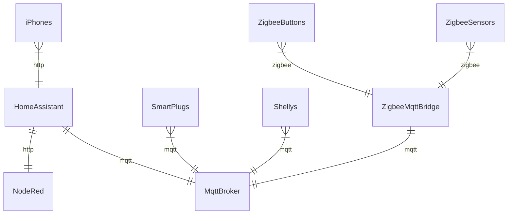

# homelab

## Automation

```mermaid
erDiagram
  iPhones }|--|| HomeAssistant : http
  HomeAssistant ||--|| NodeRed : http

  HomeAssistant ||--|| MqttBroker : mqtt
  SmartPlugs }|--|| MqttBroker : mqtt
  Shellys }|--|| MqttBroker : mqtt

  ZigbeeMqttBridge ||--|| MqttBroker : mqtt
  ZigbeeButtons }|--|| ZigbeeMqttBridge : zigbee
  ZigbeeSensors }|--|| ZigbeeMqttBridge : zigbee
```

## TODO
 - [ ] Add persistant storage for homeassistant
 - [ ] Add mqtt (metal lb?)
 - [ ] Add nodered (metal lb?)
